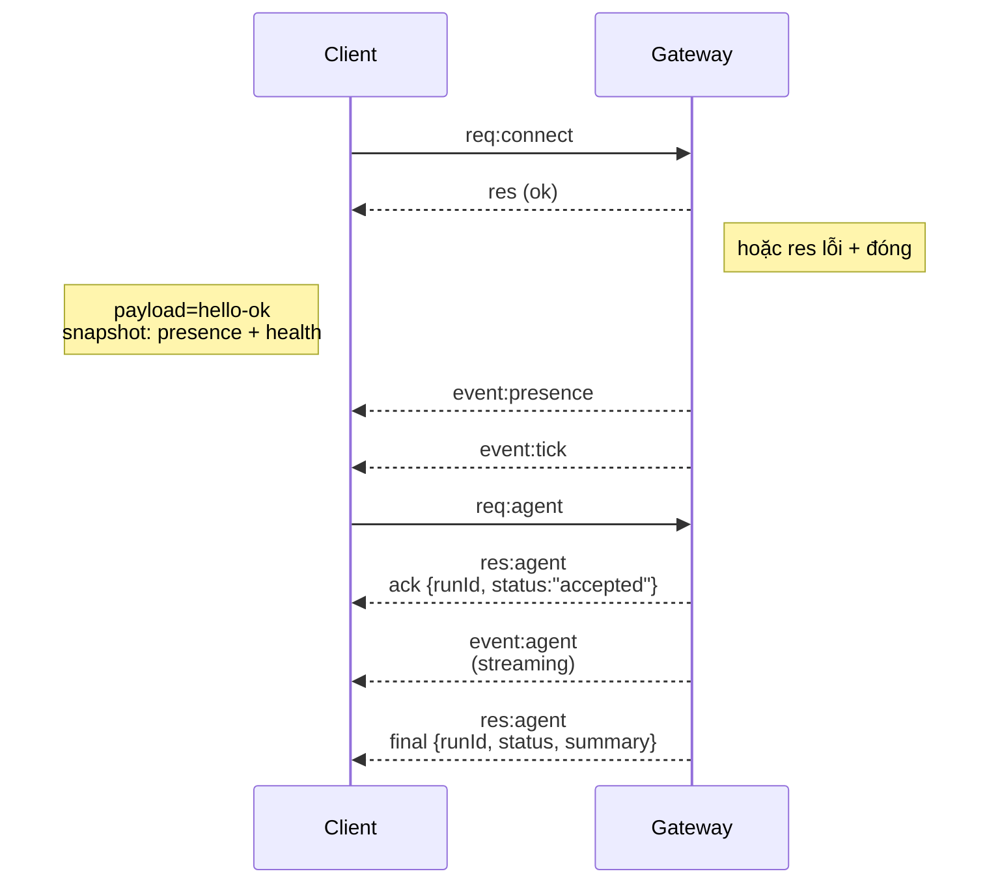

# Kiến trúc Gateway

## Tổng quan

- Một **Gateway** duy nhất và lâu dài quản lý tất cả các bề mặt nhắn tin (WhatsApp qua Baileys, Telegram qua grammY, Slack, Discord, Signal, iMessage, WebChat).
- Các khách hàng thuộc mặt điều khiển (ứng dụng macOS, CLI, giao diện web, tự động hóa) kết nối với Gateway qua **WebSocket** trên host đã cấu hình (mặc định `127.0.0.1:18789`).
- **Nodes** (macOS/iOS/Android/headless) cũng kết nối qua **WebSocket**, nhưng khai báo `role: node` với các khả năng/lệnh rõ ràng.
- Mỗi host chỉ có một Gateway; đây là nơi duy nhất mở phiên WhatsApp.
- **Canvas host** được phục vụ bởi máy chủ HTTP của Gateway dưới:
  - `/__openclaw__/canvas/` (HTML/CSS/JS có thể chỉnh sửa bởi agent)
  - `/__openclaw__/a2ui/` (host A2UI)
    Sử dụng cùng cổng với Gateway (mặc định `18789`).

## Các thành phần và luồng

### Gateway (daemon)

- Duy trì kết nối với các nhà cung cấp.
- Cung cấp một API WS kiểu (yêu cầu, phản hồi, sự kiện server-push).
- Xác thực các khung đầu vào theo JSON Schema.
- Phát ra các sự kiện như `agent`, `chat`, `presence`, `health`, `heartbeat`, `cron`.

### Khách hàng (ứng dụng mac / CLI / quản trị web)

- Mỗi khách hàng có một kết nối WS.
- Gửi yêu cầu (`health`, `status`, `send`, `agent`, `system-presence`).
- Đăng ký sự kiện (`tick`, `agent`, `presence`, `shutdown`).

### Nodes (macOS / iOS / Android / headless)

- Kết nối với **cùng máy chủ WS** với `role: node`.
- Cung cấp danh tính thiết bị trong `connect`; ghép đôi dựa trên **thiết bị** (role `node`) và phê duyệt nằm trong kho lưu trữ ghép đôi thiết bị.
- Cung cấp các lệnh như `canvas.*`, `camera.*`, `screen.record`, `location.get`.

Chi tiết giao thức:

- [Giao thức Gateway](/gateway/protocol)

### WebChat

- Giao diện tĩnh sử dụng API WS của Gateway để lấy lịch sử chat và gửi tin nhắn.
- Trong các thiết lập từ xa, kết nối qua cùng đường hầm SSH/Tailscale như các khách hàng khác.

## Vòng đời kết nối (một khách hàng)



## Giao thức truyền tải (tóm tắt)

- Phương tiện: WebSocket, khung văn bản với payload JSON.
- Khung đầu tiên **phải** là `connect`.
- Sau khi bắt tay:
  - Yêu cầu: `{type:"req", id, method, params}` → `{type:"res", id, ok, payload|error}`
  - Sự kiện: `{type:"event", event, payload, seq?, stateVersion?}`
- Nếu `OPENCLAW_GATEWAY_TOKEN` (hoặc `--token`) được thiết lập, `connect.params.auth.token` phải khớp hoặc socket sẽ đóng.
- Khóa idempotency là bắt buộc cho các phương thức có tác động phụ (`send`, `agent`) để thử lại an toàn; máy chủ giữ một bộ nhớ đệm loại bỏ trùng lặp ngắn hạn.
- Nodes phải bao gồm `role: "node"` cùng với khả năng/lệnh/quyền trong `connect`.

## Ghép đôi + tin cậy cục bộ

- Tất cả các khách hàng WS (người vận hành + nodes) bao gồm một **danh tính thiết bị** khi `connect`.
- ID thiết bị mới cần phê duyệt ghép đôi; Gateway phát hành một **token thiết bị** cho các kết nối sau đó.
- Kết nối **cục bộ** (loopback hoặc địa chỉ tailnet của chính gateway host) có thể được tự động phê duyệt để giữ trải nghiệm người dùng trên cùng host mượt mà.
- Tất cả các kết nối phải ký vào nonce `connect.challenge`.
- Payload chữ ký `v3` cũng ràng buộc `platform` + `deviceFamily`; gateway ghim metadata đã ghép đôi khi kết nối lại và yêu cầu ghép đôi lại cho các thay đổi metadata.
- Kết nối **không cục bộ** vẫn cần phê duyệt rõ ràng.
- Xác thực Gateway (`gateway.auth.*`) vẫn áp dụng cho **tất cả** các kết nối, cục bộ hoặc từ xa.

Chi tiết: [Giao thức Gateway](/gateway/protocol), [Ghép đôi](/channels/pairing),
[Bảo mật](/gateway/security).

## Kiểu giao thức và sinh mã

- Các schema TypeBox định nghĩa giao thức.
- JSON Schema được tạo từ các schema đó.
- Các mô hình Swift được tạo từ JSON Schema.

## Truy cập từ xa

- Ưu tiên: Tailscale hoặc VPN.
- Thay thế: Đường hầm SSH

  ```bash
  ssh -N -L 18789:127.0.0.1:18789 user@host
  ```

- Cùng quy trình bắt tay + token xác thực áp dụng qua đường hầm.
- TLS + ghim tùy chọn có thể được kích hoạt cho WS trong các thiết lập từ xa.

## Ảnh chụp hoạt động

- Khởi động: `openclaw gateway` (chạy nền, ghi log ra stdout).
- Tình trạng: `health` qua WS (cũng bao gồm trong `hello-ok`).
- Giám sát: launchd/systemd để tự động khởi động lại.

## Bất biến

- Chính xác một Gateway kiểm soát một phiên Baileys duy nhất trên mỗi host.
- Bắt tay là bắt buộc; bất kỳ khung đầu tiên nào không phải JSON hoặc không phải connect sẽ bị đóng cứng.
- Sự kiện không được phát lại; khách hàng phải làm mới khi có khoảng trống.
