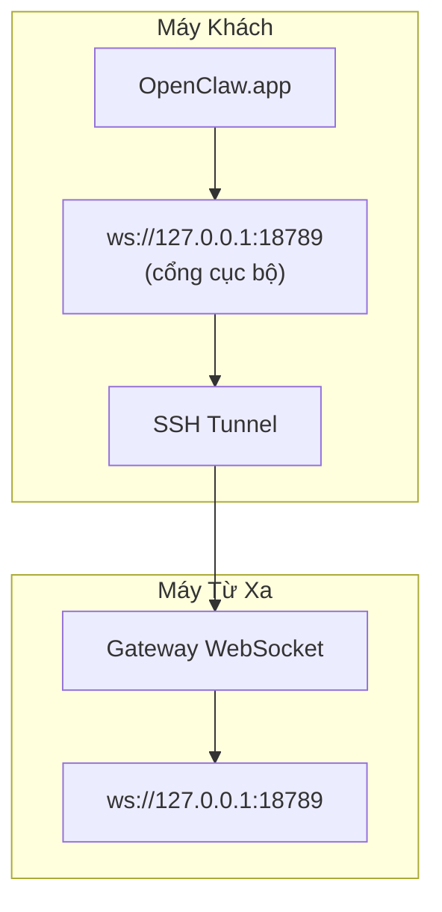

# Chạy OpenClaw.app với Gateway Từ Xa

OpenClaw.app sử dụng SSH tunneling để kết nối đến gateway từ xa. Hướng dẫn này sẽ chỉ bạn cách thiết lập.

## Tổng Quan



## Thiết Lập Nhanh

### Bước 1: Thêm Cấu Hình SSH

Chỉnh sửa `~/.ssh/config` và thêm:

```ssh
Host remote-gateway
    HostName <REMOTE_IP>          # ví dụ: 172.27.187.184
    User <REMOTE_USER>            # ví dụ: jefferson
    LocalForward 18789 127.0.0.1:18789
    IdentityFile ~/.ssh/id_rsa
```

Thay thế `<REMOTE_IP>` và `<REMOTE_USER>` bằng giá trị của bạn.

### Bước 2: Sao Chép Khóa SSH

Sao chép khóa công khai của bạn đến máy từ xa (nhập mật khẩu một lần):

```bash
ssh-copy-id -i ~/.ssh/id_rsa <REMOTE_USER>@<REMOTE_IP>
```

### Bước 3: Đặt Gateway Token

```bash
launchctl setenv OPENCLAW_GATEWAY_TOKEN "<your-token>"
```

### Bước 4: Khởi Động SSH Tunnel

```bash
ssh -N remote-gateway &
```

### Bước 5: Khởi Động Lại OpenClaw.app

```bash
# Thoát OpenClaw.app (⌘Q), sau đó mở lại:
open /path/to/OpenClaw.app
```

Ứng dụng sẽ kết nối đến gateway từ xa qua SSH tunnel.

---

## Tự Động Khởi Động Tunnel Khi Đăng Nhập

Để SSH tunnel tự động khởi động khi bạn đăng nhập, tạo một Launch Agent.

### Tạo File PLIST

Lưu file này dưới tên `~/Library/LaunchAgents/ai.openclaw.ssh-tunnel.plist`:

```xml
<?xml version="1.0" encoding="UTF-8"?>
<!DOCTYPE plist PUBLIC "-//Apple//DTD PLIST 1.0//EN" "http://www.apple.com/DTDs/PropertyList-1.0.dtd">
<plist version="1.0">
<dict>
    <key>Label</key>
    <string>ai.openclaw.ssh-tunnel</string>
    <key>ProgramArguments</key>
    <array>
        <string>/usr/bin/ssh</string>
        <string>-N</string>
        <string>remote-gateway</string>
    </array>
    <key>KeepAlive</key>
    <true/>
    <key>RunAtLoad</key>
    <true/>
</dict>
</plist>
```

### Tải Launch Agent

```bash
launchctl bootstrap gui/$UID ~/Library/LaunchAgents/ai.openclaw.ssh-tunnel.plist
```

Tunnel sẽ:

- Tự động khởi động khi bạn đăng nhập
- Khởi động lại nếu bị lỗi
- Chạy ngầm trong nền

Lưu ý cũ: xóa bất kỳ LaunchAgent `com.openclaw.ssh-tunnel` còn sót lại nếu có.

---

## Khắc Phục Sự Cố

**Kiểm tra xem tunnel có đang chạy:**

```bash
ps aux | grep "ssh -N remote-gateway" | grep -v grep
lsof -i :18789
```

**Khởi động lại tunnel:**

```bash
launchctl kickstart -k gui/$UID/ai.openclaw.ssh-tunnel
```

**Dừng tunnel:**

```bash
launchctl bootout gui/$UID/ai.openclaw.ssh-tunnel
```

---

## Cách Hoạt Động

| Thành Phần                           | Chức Năng                                                    |
| ------------------------------------ | ------------------------------------------------------------ |
| `LocalForward 18789 127.0.0.1:18789` | Chuyển tiếp cổng cục bộ 18789 đến cổng từ xa 18789           |
| `ssh -N`                             | SSH mà không thực thi lệnh từ xa (chỉ chuyển tiếp cổng)      |
| `KeepAlive`                          | Tự động khởi động lại tunnel nếu bị lỗi                      |
| `RunAtLoad`                          | Khởi động tunnel khi agent được tải                          |

OpenClaw.app kết nối đến `ws://127.0.0.1:18789` trên máy khách của bạn. SSH tunnel chuyển tiếp kết nối đó đến cổng 18789 trên máy từ xa nơi Gateway đang chạy.
