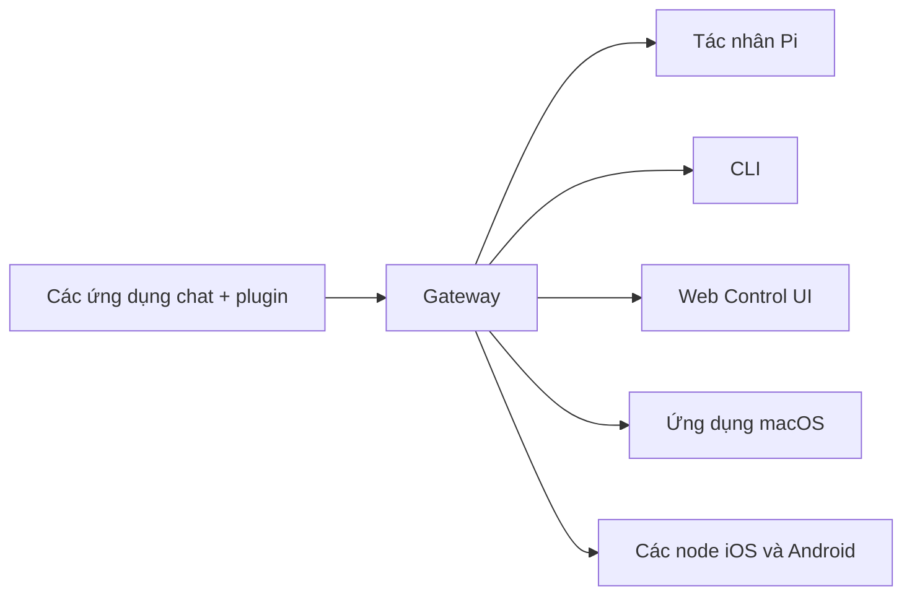

# OpenClaw 🦞

<p align="center">
  

  
</p>

> _"EXFOLIATE! EXFOLIATE!"_ — Có lẽ là lời của một con tôm hùm vũ trụ nào đó

<p align="center">
  <strong>Gateway chạy trên mọi hệ điều hành dành cho các tác nhân AI qua WhatsApp, Telegram, Discord, iMessage và nhiều nền tảng khác.</strong><br />
  Chỉ cần gửi tin nhắn là bạn sẽ nhận được phản hồi từ AI ngay trên điện thoại. Có thể bổ sung Mattermost và các kênh khác thông qua plugin.
</p>

<Columns>
  <Card title="Bắt đầu ngay" icon="rocket" href="/start/getting-started">
    Cài đặt OpenClaw và khởi chạy Gateway chỉ trong vài phút.
  </Card>

  <Card title="Khởi chạy cấu hình" icon="sparkles" href="/start/wizard">
    Thiết lập theo từng bước với lệnh `openclaw onboard` và quy trình liên kết.
  </Card>

  <Card title="Mở Control UI" icon="layout-dashboard" href="/web/control-ui">
    Khởi chạy bảng điều khiển (dashboard) trên trình duyệt để quản lý chat, cấu hình và phiên (sessions).
  </Card>
</Columns>

## OpenClaw là gì?

OpenClaw là một **gateway tự lưu trữ (self-hosted)** giúp kết nối các ứng dụng chat quen thuộc của bạn — như WhatsApp, Telegram, Discord, iMessage, và nhiều nền tảng khác — với các tác nhân AI lập trình như Pi. Bạn chỉ cần chạy một quy trình Gateway duy nhất trên máy tính (hoặc server) của mình, và nó sẽ trở thành cầu nối giữa các ứng dụng nhắn tin và trợ lý AI luôn sẵn sàng phục vụ.

**Dành cho ai?** Dành cho các nhà phát triển và người dùng chuyên nghiệp (power users) muốn có một trợ lý AI cá nhân để nhắn tin từ bất kỳ đâu — mà không phải đánh đổi quyền kiểm soát dữ liệu hay phụ thuộc vào các dịch vụ bên thứ ba.

**Điều gì làm nên sự khác biệt?**

- **Tự lưu trữ**: chạy trên thiết bị của bạn, theo quy tắc của bạn
- **Đa kênh**: một Gateway duy nhất phục vụ đồng thời WhatsApp, Telegram, Discord và nhiều kênh khác
- **Tối ưu cho tác nhân AI**: được xây dựng riêng cho các tác nhân lập trình với khả năng sử dụng công cụ, quản lý phiên (sessions), bộ nhớ (memory) và định tuyến đa tác nhân (multi-agent routing)
- **Mã nguồn mở**: cấp phép theo chuẩn MIT, thân thiện với cộng đồng

**Bạn cần chuẩn bị gì?** Node 24 (khuyên dùng), hoặc Node 22 LTS (`22.16+`) để tương thích tốt nhất; một API key từ nhà cung cấp mô hình (provider) bạn chọn; và khoảng 5 phút thiết lập. Để đạt được chất lượng và độ bảo mật cao nhất, hãy sử dụng mô hình thế hệ mới nhất hiện có.

## Cách thức hoạt động



Gateway đóng vai trò là nguồn dữ liệu thực (source of truth) duy nhất quản lý các phiên (sessions), định tuyến (routing) và các kết nối kênh.

## Các tính năng chính

<Columns>
  <Card title="Gateway đa kênh" icon="network">
    Kết nối WhatsApp, Telegram, Discord và iMessage chỉ bằng một quy trình Gateway duy nhất.
  </Card>

  <Card title="Kênh Plugin" icon="plug">
    Bổ sung Mattermost và các nền tảng khác bằng các gói tiện ích mở rộng (extension).
  </Card>

  <Card title="Định tuyến đa tác nhân" icon="route">
    Các phiên được tách biệt riêng cho từng tác nhân, workspace hoặc người gửi.
  </Card>

  <Card title="Hỗ trợ đa phương tiện" icon="image">
    Gửi và nhận hình ảnh, âm thanh, cũng như tài liệu.
  </Card>

  <Card title="Web Control UI" icon="monitor">
    Bảng điều khiển trên trình duyệt để quản lý chat, cấu hình, phiên và các node.
  </Card>

  <Card title="Các node di động" icon="smartphone">
    Liên kết các node iOS và Android để sử dụng Canvas, camera và các luồng công việc kích hoạt bằng giọng nói.
  </Card>
</Columns>

## Hướng dẫn nhanh

<Steps>
  <Step title="Cài đặt OpenClaw">
    ```bash
    npm install -g openclaw@latest
    ```
  </Step>
  <Step title="Cấu hình và cài đặt dịch vụ">
    ```bash
    openclaw onboard --install-daemon
    ```
  </Step>
  <Step title="Bắt đầu chat">
    Mở Control UI trên trình duyệt và gửi tin nhắn:

    ```bash
    openclaw dashboard
    ```

    Hoặc kết nối một kênh ([Telegram](/channels/telegram) dễ kết nối nhất) và chat ngay từ điện thoại của bạn.
  </Step>
</Steps>

Nếu bạn cần hướng dẫn chi tiết về quy trình cài đặt và thiết lập môi trường phát triển (dev setup), hãy xem phần [Bắt đầu](/start/getting-started).

## Bảng điều khiển (Dashboard)

Mở Control UI trên trình duyệt sau khi Gateway khởi động thành công.

- Mặc định trên máy cục bộ: [http://127.0.0.1:18789/](http://127.0.0.1:18789/)
- Truy cập từ xa: Qua [các giao diện Web](/web) và [Tailscale](/gateway/tailscale)

<p align="center">
  
</p>

## Cấu hình (Tùy chọn)

File cấu hình được lưu tại `~/.openclaw/openclaw.json`.

- Nếu bạn **không thiết lập gì**, OpenClaw sẽ sử dụng luồng chạy (binary) Pi được tích hợp sẵn ở chế độ RPC với các phiên được tách riêng theo từng người gửi.
- Nếu bạn muốn thắt chặt quyền truy cập, hãy bắt đầu với mục `channels.whatsapp.allowFrom` và cấu hình luật bắt buộc nhắc đến (requireMention) đối với các nhóm.

Ví dụ:

```json5
{
  channels: {
    whatsapp: {
      allowFrom: ["+15555550123"],
      groups: { "*": { requireMention: true } },
    },
  },
  messages: { groupChat: { mentionPatterns: ["@openclaw"] } },
}
```

## Bắt đầu từ đây

<Columns>
  <Card title="Trung tâm tài liệu" icon="book-open" href="/start/hubs">
    Toàn bộ tài liệu và hướng dẫn, được phân loại theo từng mục đích sử dụng.
  </Card>

  <Card title="Cấu hình" icon="settings" href="/gateway/configuration">
    Các thiết lập cốt lõi của Gateway, quản lý token và cấu hình nhà cung cấp (provider).
  </Card>

  <Card title="Truy cập từ xa" icon="globe" href="/gateway/remote">
    Tổ chức truy cập qua SSH và mạng tailnet.
  </Card>

  <Card title="Các kênh" icon="message-square" href="/channels/telegram">
    Hướng dẫn thao tác thiết lập đặc thù cho WhatsApp, Telegram, Discord và nhiều nền tảng khác.
  </Card>

  <Card title="Các node" icon="smartphone" href="/nodes">
    Các node trên iOS và Android với khả năng kết nối thiết bị để dùng Canvas, camera và ra lệnh hệ thống.
  </Card>

  <Card title="Trợ giúp" icon="life-buoy" href="/help">
    Điểm dừng chân đầu tiên khi có sự cố và các cách khắc phục phổ biến.
  </Card>
</Columns>

## Tìm hiểu thêm

<Columns>
  <Card title="Danh sách tính năng đầy đủ" icon="list" href="/concepts/features">
    Tổng hợp toàn bộ khả năng về kênh hỗ trợ, định tuyến và đa phương tiện.
  </Card>

  <Card title="Định tuyến đa tác nhân" icon="route" href="/concepts/multi-agent">
    Sự tách biệt workspace và quản lý phiên (session) theo từng tác nhân.
  </Card>

  <Card title="Bảo mật" icon="shield" href="/gateway/security">
    Quản lý tokens, danh sách cho phép (allowlists) và các lớp kiểm soát an toàn.
  </Card>

  <Card title="Khắc phục sự cố" icon="wrench" href="/gateway/troubleshooting">
    Công cụ chẩn đoán Gateway và các lỗi thường gặp trong quá trình vận hành.
  </Card>

  <Card title="Giới thiệu và đội ngũ" icon="info" href="/reference/credits">
    Nguồn gốc dự án, những người đóng góp và thông tin giấy phép.
  </Card>
</Columns>