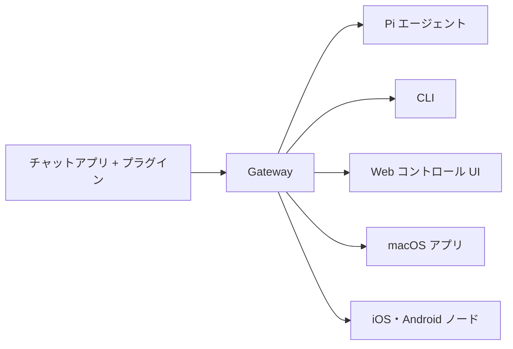

# OpenClaw 🦞

<p align="center">
    
    
</p>

> _"EXFOLIATE! EXFOLIATE!"_ — たぶん宇宙ロブスターの言葉

<p align="center">
  <strong>WhatsApp、Telegram、Discord、iMessage などに対応した、あらゆる OS で動作する AI エージェントゲートウェイ。</strong><br />
  メッセージを送信すれば、ポケットからエージェントの応答を受け取れます。プラグインで Mattermost などを追加可能。
</p>

<Columns>
  <Card title="はじめに" href="/start/getting-started" icon="rocket">
    OpenClaw をインストールして数分で Gateway を起動しましょう。
  </Card>
  <Card title="オンボーディングを実行" href="/start/wizard" icon="sparkles">
    `openclaw onboard` とペアリングフローによるガイド付きセットアップ。
  </Card>
  <Card title="コントロール UI を開く" href="/web/control-ui" icon="layout-dashboard">
    チャット、設定、セッション管理用のブラウザダッシュボードを起動。
  </Card>
</Columns>

## OpenClaw とは？

OpenClaw は、お気に入りのチャットアプリ — WhatsApp、Telegram、Discord、iMessage など — を Pi のような AI コーディングエージェントに接続する**セルフホスト型ゲートウェイ**です。自分のマシン（またはサーバー）上で単一の Gateway プロセスを実行するだけで、メッセージングアプリと常時利用可能な AI アシスタントの間の橋渡しになります。

**誰向け？** データの管理を手放したり、ホストサービスに頼ったりせずに、どこからでもメッセージを送れる個人 AI アシスタントを求める開発者やパワーユーザー。

**何が違う？**

- **セルフホスト**：自分のハードウェアで動作、自分のルール
- **マルチチャネル**：1 つの Gateway が WhatsApp、Telegram、Discord などを同時にサービス
- **エージェントネイティブ**：ツール使用、セッション、メモリ、マルチエージェントルーティングを備えたコーディングエージェント向けに構築
- **オープンソース**：MIT ライセンス、コミュニティ駆動

**何が必要？** Node 24（推奨）、または互換性のための Node 22 LTS（`22.16+`）、選択したプロバイダーの API キー、そして 5 分。最高の品質とセキュリティのために、利用可能な最新世代の最強モデルを使用してください。

## 仕組み



Gateway はセッション、ルーティング、チャネル接続の唯一の情報源です。

## 主な機能

<Columns>
  <Card title="マルチチャネルゲートウェイ" icon="network">
    WhatsApp、Telegram、Discord、iMessage を単一の Gateway プロセスで。
  </Card>
  <Card title="プラグインチャネル" icon="plug">
    拡張パッケージで Mattermost などを追加。
  </Card>
  <Card title="マルチエージェントルーティング" icon="route">
    エージェント、ワークスペース、送信者ごとに分離されたセッション。
  </Card>
  <Card title="メディアサポート" icon="image">
    画像、音声、ドキュメントの送受信。
  </Card>
  <Card title="Web コントロール UI" icon="monitor">
    チャット、設定、セッション、ノード用のブラウザダッシュボード。
  </Card>
  <Card title="モバイルノード" icon="smartphone">
    iOS・Android ノードをペアリングして Canvas、カメラ、音声ワークフローを実現。
  </Card>
</Columns>

## クイックスタート

<Steps>
  <Step title="OpenClaw をインストール">
    ```bash
    npm install -g openclaw@latest
    ```
  </Step>
  <Step title="オンボーディングとサービスのインストール">
    ```bash
    openclaw onboard --install-daemon
    ```
  </Step>
  <Step title="チャット">
    ブラウザでコントロール UI を開いてメッセージを送信：

    ```bash
    openclaw dashboard
    ```

    またはチャネルを接続して（[Telegram](/channels/telegram) が最速）スマホからチャット。

  </Step>
</Steps>

完全なインストールと開発セットアップが必要ですか？[はじめに](/start/getting-started)をご覧ください。

## ダッシュボード

Gateway 起動後にブラウザのコントロール UI を開きます。

- ローカルデフォルト：[http://127.0.0.1:18789/](http://127.0.0.1:18789/)
- リモートアクセス：[Web インターフェース](/web) と [Tailscale](/gateway/tailscale)

<p align="center">
  
</p>

## 設定（オプション）

設定ファイルは `~/.openclaw/openclaw.json` にあります。

- **何もしなければ**、OpenClaw は内蔵の Pi バイナリを RPC モードで使用し、送信者ごとのセッションで動作します。
- ロックダウンしたい場合は、`channels.whatsapp.allowFrom` と（グループの場合）メンションルールから始めてください。

例：

```json5
{
  channels: {
    whatsapp: {
      allowFrom: ["+15555550123"],
      groups: { "*": { requireMention: true } },
    },
  },
  messages: { groupChat: { mentionPatterns: ["@openclaw"] } },
}
```

## ここから始める

<Columns>
  <Card title="ドキュメントハブ" href="/start/hubs" icon="book-open">
    ユースケース別に整理されたすべてのドキュメントとガイド。
  </Card>
  <Card title="設定" href="/gateway/configuration" icon="settings">
    コア Gateway 設定、トークン、プロバイダー設定。
  </Card>
  <Card title="リモートアクセス" href="/gateway/remote" icon="globe">
    SSH と tailnet アクセスパターン。
  </Card>
  <Card title="チャネル" href="/channels/telegram" icon="message-square">
    WhatsApp、Telegram、Discord などのチャネル固有のセットアップ。
  </Card>
  <Card title="ノード" href="/nodes" icon="smartphone">
    iOS・Android ノード（ペアリング、Canvas、カメラ、デバイスアクション対応）。
  </Card>
  <Card title="ヘルプ" href="/help" icon="life-buoy">
    よくある修正とトラブルシューティングの入口。
  </Card>
</Columns>

## さらに詳しく

<Columns>
  <Card title="全機能一覧" href="/concepts/features" icon="list">
    チャネル、ルーティング、メディア機能の完全なリスト。
  </Card>
  <Card title="マルチエージェントルーティング" href="/concepts/multi-agent" icon="route">
    ワークスペース分離とエージェントごとのセッション。
  </Card>
  <Card title="セキュリティ" href="/gateway/security" icon="shield">
    トークン、許可リスト、安全制御。
  </Card>
  <Card title="トラブルシューティング" href="/gateway/troubleshooting" icon="wrench">
    Gateway 診断とよくあるエラー。
  </Card>
  <Card title="プロジェクト情報とクレジット" href="/reference/credits" icon="info">
    プロジェクトの起源、コントリビューター、ライセンス。
  </Card>
</Columns>
