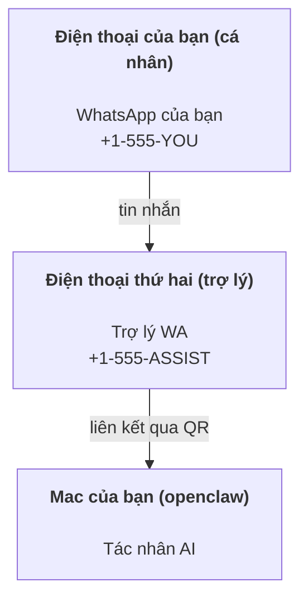

# Xây dựng trợ lý cá nhân với OpenClaw

OpenClaw là một gateway tự lưu trữ, kết nối WhatsApp, Telegram, Discord, iMessage và nhiều hơn nữa với các tác nhân AI. Hướng dẫn này bao gồm thiết lập "trợ lý cá nhân": một số WhatsApp chuyên dụng hoạt động như trợ lý AI luôn sẵn sàng.

## ⚠️ An toàn là trên hết

Bạn đang đặt một tác nhân vào vị trí có thể:

- chạy lệnh trên máy của bạn (tùy thuộc vào chính sách công cụ)
- đọc/ghi tệp trong workspace của bạn
- gửi tin nhắn qua WhatsApp/Telegram/Discord/Mattermost (plugin)

Bắt đầu một cách thận trọng:

- Luôn đặt `channels.whatsapp.allowFrom` (không bao giờ chạy mở cho toàn thế giới trên Mac cá nhân).
- Sử dụng một số WhatsApp riêng cho trợ lý.
- Heartbeats mặc định là mỗi 30 phút. Vô hiệu hóa cho đến khi bạn tin tưởng thiết lập bằng cách đặt `agents.defaults.heartbeat.every: "0m"`.

## Yêu cầu trước

- Đã cài đặt và khởi tạo OpenClaw — xem [Bắt đầu](/start/getting-started) nếu bạn chưa làm điều này
- Một số điện thoại thứ hai (SIM/eSIM/trả trước) cho trợ lý

## Thiết lập hai điện thoại (khuyến nghị)

Bạn cần điều này:



Nếu bạn liên kết WhatsApp cá nhân với OpenClaw, mọi tin nhắn gửi đến bạn sẽ trở thành “đầu vào của tác nhân”. Điều này hiếm khi là điều bạn muốn.

## Bắt đầu nhanh trong 5 phút

1. Ghép đôi WhatsApp Web (hiển thị QR; quét bằng điện thoại trợ lý):

```bash
openclaw channels login
```

2. Khởi động Gateway (để nó chạy):

```bash
openclaw gateway --port 18789
```

3. Đặt cấu hình tối thiểu trong `~/.openclaw/openclaw.json`:

```json5
{
  channels: { whatsapp: { allowFrom: ["+15555550123"] } },
}
```

Bây giờ hãy nhắn tin đến số trợ lý từ điện thoại đã được cho phép.

Khi hoàn tất khởi tạo, chúng tôi tự động mở dashboard và in ra một liên kết sạch (không có token). Nếu được yêu cầu xác thực, dán token từ `gateway.auth.token` vào cài đặt Control UI. Để mở lại sau: `openclaw dashboard`.

## Cung cấp workspace cho tác nhân (AGENTS)

OpenClaw đọc hướng dẫn hoạt động và “bộ nhớ” từ thư mục workspace của nó.

Mặc định, OpenClaw sử dụng `~/.openclaw/workspace` làm workspace cho tác nhân và sẽ tự động tạo nó (cùng với các tệp khởi đầu `AGENTS.md`, `SOUL.md`, `TOOLS.md`, `IDENTITY.md`, `USER.md`, `HEARTBEAT.md`) khi thiết lập/chạy tác nhân lần đầu. `BOOTSTRAP.md` chỉ được tạo khi workspace hoàn toàn mới (nó sẽ không xuất hiện lại sau khi bạn xóa nó). `MEMORY.md` là tùy chọn (không tự động tạo); khi có, nó được tải cho các phiên bình thường. Các phiên subagent chỉ chèn `AGENTS.md` và `TOOLS.md`.

Mẹo: coi thư mục này như “bộ nhớ” của OpenClaw và biến nó thành một repo git (tốt nhất là riêng tư) để các tệp `AGENTS.md` + bộ nhớ của bạn được sao lưu. Nếu git được cài đặt, các workspace hoàn toàn mới sẽ được tự động khởi tạo.

```bash
openclaw setup
```

Hướng dẫn bố trí workspace đầy đủ + sao lưu: [Agent workspace](/concepts/agent-workspace)
Quy trình làm việc với bộ nhớ: [Memory](/concepts/memory)

Tùy chọn: chọn một workspace khác với `agents.defaults.workspace` (hỗ trợ `~`).

```json5
{
  agent: {
    workspace: "~/.openclaw/workspace",
  },
}
```

Nếu bạn đã có các tệp workspace của riêng mình từ một repo, bạn có thể vô hiệu hóa hoàn toàn việc tạo tệp bootstrap:

```json5
{
  agent: {
    skipBootstrap: true,
  },
}
```

## Cấu hình biến nó thành "một trợ lý"

OpenClaw mặc định thiết lập trợ lý tốt, nhưng bạn thường muốn điều chỉnh:

- nhân vật/hướng dẫn trong `SOUL.md`
- mặc định suy nghĩ (nếu muốn)
- heartbeats (khi bạn tin tưởng nó)

Ví dụ:

```json5
{
  logging: { level: "info" },
  agent: {
    model: "anthropic/claude-opus-4-6",
    workspace: "~/.openclaw/workspace",
    thinkingDefault: "high",
    timeoutSeconds: 1800,
    // Bắt đầu với 0; kích hoạt sau.
    heartbeat: { every: "0m" },
  },
  channels: {
    whatsapp: {
      allowFrom: ["+15555550123"],
      groups: {
        "*": { requireMention: true },
      },
    },
  },
  routing: {
    groupChat: {
      mentionPatterns: ["@openclaw", "openclaw"],
    },
  },
  session: {
    scope: "per-sender",
    resetTriggers: ["/new", "/reset"],
    reset: {
      mode: "daily",
      atHour: 4,
      idleMinutes: 10080,
    },
  },
}
```

## Phiên và bộ nhớ

- Tệp phiên: `~/.openclaw/agents/<agentId>/sessions/{{SessionId}}.jsonl`
- Metadata phiên (sử dụng token, tuyến cuối, v.v.): `~/.openclaw/agents/<agentId>/sessions/sessions.json` (cũ: `~/.openclaw/sessions/sessions.json`)
- `/new` hoặc `/reset` bắt đầu một phiên mới cho cuộc trò chuyện đó (có thể cấu hình qua `resetTriggers`). Nếu gửi một mình, tác nhân sẽ trả lời với một lời chào ngắn để xác nhận việc đặt lại.
- `/compact [instructions]` nén ngữ cảnh phiên và báo cáo ngân sách ngữ cảnh còn lại.

## Heartbeats (chế độ chủ động)

Mặc định, OpenClaw chạy một heartbeat mỗi 30 phút với lời nhắc:
`Đọc HEARTBEAT.md nếu nó tồn tại (ngữ cảnh workspace). Tuân thủ nghiêm ngặt. Không suy diễn hoặc lặp lại các nhiệm vụ cũ từ các cuộc trò chuyện trước. Nếu không có gì cần chú ý, trả lời HEARTBEAT_OK.`
Đặt `agents.defaults.heartbeat.every: "0m"` để vô hiệu hóa.

- Nếu `HEARTBEAT.md` tồn tại nhưng thực tế trống (chỉ có dòng trống và tiêu đề markdown như `# Heading`), OpenClaw bỏ qua chạy heartbeat để tiết kiệm các cuộc gọi API.
- Nếu tệp bị thiếu, heartbeat vẫn chạy và mô hình quyết định phải làm gì.
- Nếu tác nhân trả lời với `HEARTBEAT_OK` (có thể có đệm ngắn; xem `agents.defaults.heartbeat.ackMaxChars`), OpenClaw ngăn chặn việc gửi đi cho heartbeat đó.
- Mặc định, việc gửi heartbeat đến các mục tiêu kiểu DM `user:<id>` được cho phép. Đặt `agents.defaults.heartbeat.directPolicy: "block"` để ngăn chặn việc gửi trực tiếp trong khi vẫn giữ các lần chạy heartbeat hoạt động.
- Heartbeats chạy toàn bộ lượt tác nhân — khoảng thời gian ngắn hơn tiêu tốn nhiều token hơn.

```json5
{
  agent: {
    heartbeat: { every: "30m" },
  },
}
```

## Media vào và ra

Các tệp đính kèm đầu vào (hình ảnh/âm thanh/tài liệu) có thể được đưa vào lệnh của bạn qua các mẫu:

- `{{MediaPath}}` (đường dẫn tệp tạm thời cục bộ)
- `{{MediaUrl}}` (pseudo-URL)
- `{{Transcript}}` (nếu bật chuyển đổi âm thanh thành văn bản)

Các tệp đính kèm đầu ra từ tác nhân: bao gồm `MEDIA:<path-or-url>` trên một dòng riêng (không có khoảng trắng). Ví dụ:

```
Đây là ảnh chụp màn hình.
MEDIA:https://example.com/screenshot.png
```

OpenClaw sẽ trích xuất và gửi chúng như media kèm theo văn bản.

## Danh sách kiểm tra hoạt động

```bash
openclaw status          # trạng thái cục bộ (thông tin đăng nhập, phiên, sự kiện trong hàng đợi)
openclaw status --all    # chẩn đoán đầy đủ (chỉ đọc, có thể dán)
openclaw status --deep   # thêm kiểm tra sức khỏe gateway (Telegram + Discord)
openclaw health --json   # ảnh chụp sức khỏe gateway (WS)
```

Nhật ký nằm dưới `/tmp/openclaw/` (mặc định: `openclaw-YYYY-MM-DD.log`).

## Bước tiếp theo

- WebChat: [WebChat](/web/webchat)
- Vận hành Gateway: [Sổ tay Gateway](/gateway)
- Cron + đánh thức: [Công việc Cron](/automation/cron-jobs)
- Ứng dụng đồng hành trên thanh menu macOS: [Ứng dụng OpenClaw macOS](/platforms/macos)
- Ứng dụng node iOS: [Ứng dụng iOS](/platforms/ios)
- Ứng dụng node Android: [Ứng dụng Android](/platforms/android)
- Trạng thái Windows: [Windows (WSL2)](/platforms/windows)
- Trạng thái Linux: [Ứng dụng Linux](/platforms/linux)
- Bảo mật: [Bảo mật](/gateway/security)
