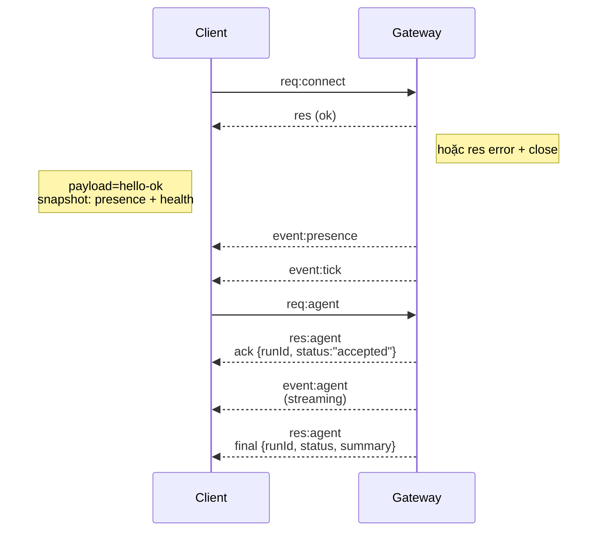

# Kiến trúc Gateway

## Tổng quan

- **Gateway** duy nhất quản lý tất cả các kênh nhắn tin (WhatsApp qua Baileys, Telegram qua grammY, Slack, Discord, Signal, iMessage, WebChat).
- Các client control-plane (ứng dụng macOS, CLI, web UI, tự động hóa) kết nối với Gateway qua **WebSocket** trên host đã cấu hình (mặc định `127.0.0.1:18789`).
- **Nodes** (macOS/iOS/Android/headless) cũng kết nối qua **WebSocket**, nhưng khai báo `role: node` với các khả năng/lệnh cụ thể.
- Mỗi host chỉ có một Gateway; đây là nơi duy nhất mở session WhatsApp.
- **Canvas host** được phục vụ bởi server HTTP của Gateway dưới:
  - `/__openclaw__/canvas/` (HTML/CSS/JS có thể chỉnh sửa bởi agent)
  - `/__openclaw__/a2ui/` (A2UI host)
    Dùng cùng cổng với Gateway (mặc định `18789`).

## Thành phần và luồng hoạt động

### Gateway (daemon)

- Duy trì kết nối với provider.
- Cung cấp WS API kiểu (yêu cầu, phản hồi, sự kiện server-push).
- Xác thực frame đầu vào theo JSON Schema.
- Phát ra các sự kiện như `agent`, `chat`, `presence`, `health`, `heartbeat`, `cron`.

### Clients (ứng dụng mac / CLI / web admin)

- Mỗi client có một kết nối WS.
- Gửi yêu cầu (`health`, `status`, `send`, `agent`, `system-presence`).
- Đăng ký sự kiện (`tick`, `agent`, `presence`, `shutdown`).

### Nodes (macOS / iOS / Android / headless)

- Kết nối với **cùng WS server** với `role: node`.
- Cung cấp danh tính thiết bị trong `connect`; ghép đôi dựa trên **thiết bị** (role `node`) và phê duyệt lưu trong store ghép đôi thiết bị.
- Cung cấp các lệnh như `canvas.*`, `camera.*`, `screen.record`, `location.get`.

Chi tiết giao thức:

- [Gateway protocol](/gateway/protocol)

### WebChat

- Giao diện tĩnh sử dụng Gateway WS API để lấy lịch sử chat và gửi tin.
- Trong thiết lập từ xa, kết nối qua cùng SSH/Tailscale tunnel như các client khác.

## Vòng đời kết nối (một client)



## Giao thức wire (tóm tắt)

- Transport: WebSocket, frame text với payload JSON.
- Frame đầu tiên **phải** là `connect`.
- Sau handshake:
  - Yêu cầu: `{type:"req", id, method, params}` → `{type:"res", id, ok, payload|error}`
  - Sự kiện: `{type:"event", event, payload, seq?, stateVersion?}`
- Nếu `OPENCLAW_GATEWAY_TOKEN` (hoặc `--token`) được thiết lập, `connect.params.auth.token` phải khớp hoặc socket sẽ đóng.
- Khóa idempotency cần thiết cho các phương thức có tác động phụ (`send`, `agent`) để retry an toàn; server giữ cache dedupe ngắn hạn.
- Nodes phải bao gồm `role: "node"` cùng khả năng/lệnh/quyền trong `connect`.

## Ghép đôi + tin cậy local

- Tất cả WS client (operator + node) bao gồm **danh tính thiết bị** khi `connect`.
- ID thiết bị mới cần phê duyệt ghép đôi; Gateway cấp **device token** cho các kết nối sau.
- Kết nối **local** (loopback hoặc địa chỉ tailnet của host gateway) có thể tự động phê duyệt để UX cùng host mượt mà.
- Tất cả kết nối phải ký `connect.challenge` nonce.
- Payload chữ ký `v3` cũng ràng buộc `platform` + `deviceFamily`; gateway ghim metadata đã ghép đôi khi reconnect và yêu cầu ghép đôi lại khi metadata thay đổi.
- Kết nối **không local** vẫn cần phê duyệt rõ ràng.
- Xác thực Gateway (`gateway.auth.*`) vẫn áp dụng cho **tất cả** kết nối, local hoặc remote.

Chi tiết: [Gateway protocol](/gateway/protocol), [Pairing](/channels/pairing), [Security](/gateway/security).

## Giao thức typing và codegen

- TypeBox schemas định nghĩa giao thức.
- JSON Schema được tạo từ các schemas đó.
- Mô hình Swift được tạo từ JSON Schema.

## Truy cập từ xa

- Ưu tiên: Tailscale hoặc VPN.
- Thay thế: SSH tunnel

  ```bash
  ssh -N -L 18789:127.0.0.1:18789 user@host
  ```

- Cùng handshake + auth token áp dụng qua tunnel.
- TLS + pinning tùy chọn có thể bật cho WS trong thiết lập từ xa.

## Ảnh chụp hoạt động

- Khởi động: `openclaw gateway` (foreground, log ra stdout).
- Kiểm tra sức khỏe: `health` qua WS (cũng bao gồm trong `hello-ok`).
- Giám sát: launchd/systemd để tự động khởi động lại.

## Bất biến

- Chính xác một Gateway kiểm soát một session Baileys duy nhất trên mỗi host.
- Handshake là bắt buộc; bất kỳ frame đầu tiên không phải JSON hoặc không phải connect sẽ bị đóng cứng.
- Sự kiện không được phát lại; client phải refresh khi có khoảng trống.\n