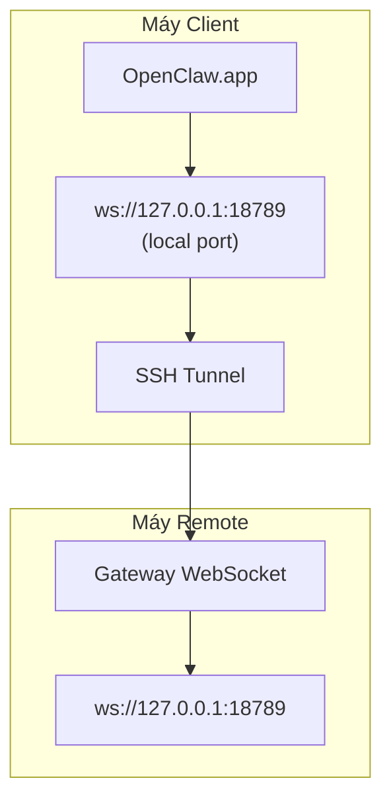

# Chạy OpenClaw.app với Remote Gateway

OpenClaw.app dùng SSH tunneling để kết nối đến remote gateway. Hướng dẫn này chỉ cách thiết lập.

## Tổng quan



## Thiết lập nhanh

### Bước 1: Thêm SSH Config

Sửa `~/.ssh/config` và thêm:

```ssh
Host remote-gateway
    HostName <REMOTE_IP>          # ví dụ: 172.27.187.184
    User <REMOTE_USER>            # ví dụ: jefferson
    LocalForward 18789 127.0.0.1:18789
    IdentityFile ~/.ssh/id_rsa
```

Thay `<REMOTE_IP>` và `<REMOTE_USER>` bằng giá trị của bạn.

### Bước 2: Copy SSH Key

Copy public key đến máy remote (nhập mật khẩu một lần):

```bash
ssh-copy-id -i ~/.ssh/id_rsa <REMOTE_USER>@<REMOTE_IP>
```

### Bước 3: Đặt Gateway Token

```bash
launchctl setenv OPENCLAW_GATEWAY_TOKEN "<your-token>"
```

### Bước 4: Khởi động SSH Tunnel

```bash
ssh -N remote-gateway &
```

### Bước 5: Khởi động lại OpenClaw.app

```bash
# Thoát OpenClaw.app (⌘Q), sau đó mở lại:
open /path/to/OpenClaw.app
```

App sẽ kết nối đến remote gateway qua SSH tunnel.

---

## Tự động khởi động Tunnel khi đăng nhập

Để SSH tunnel tự động khởi động khi đăng nhập, tạo một Launch Agent.

### Tạo file PLIST

Lưu file này thành `~/Library/LaunchAgents/ai.openclaw.ssh-tunnel.plist`:

```xml
<?xml version="1.0" encoding="UTF-8"?>
<!DOCTYPE plist PUBLIC "-//Apple//DTD PLIST 1.0//EN" "http://www.apple.com/DTDs/PropertyList-1.0.dtd">
<plist version="1.0">
<dict>
    <key>Label</key>
    <string>ai.openclaw.ssh-tunnel</string>
    <key>ProgramArguments</key>
    <array>
        <string>/usr/bin/ssh</string>
        <string>-N</string>
        <string>remote-gateway</string>
    </array>
    <key>KeepAlive</key>
    <true/>
    <key>RunAtLoad</key>
    <true/>
</dict>
</plist>
```

### Load Launch Agent

```bash
launchctl bootstrap gui/$UID ~/Library/LaunchAgents/ai.openclaw.ssh-tunnel.plist
```

Tunnel sẽ:

- Tự động khởi động khi đăng nhập
- Khởi động lại nếu bị crash
- Chạy nền liên tục

Lưu ý: xóa bất kỳ LaunchAgent `com.openclaw.ssh-tunnel` còn sót lại nếu có.

---

## Khắc phục sự cố

**Kiểm tra tunnel có đang chạy:**

```bash
ps aux | grep "ssh -N remote-gateway" | grep -v grep
lsof -i :18789
```

**Khởi động lại tunnel:**

```bash
launchctl kickstart -k gui/$UID/ai.openclaw.ssh-tunnel
```

**Dừng tunnel:**

```bash
launchctl bootout gui/$UID/ai.openclaw.ssh-tunnel
```

---

## Cách hoạt động

| Thành phần                           | Chức năng                                                    |
| ------------------------------------ | ------------------------------------------------------------ |
| `LocalForward 18789 127.0.0.1:18789` | Chuyển tiếp cổng local 18789 đến cổng remote 18789           |
| `ssh -N`                             | SSH không thực thi lệnh remote (chỉ port forwarding)         |
| `KeepAlive`                          | Tự động khởi động lại tunnel nếu bị crash                    |
| `RunAtLoad`                          | Khởi động tunnel khi agent được load                         |

OpenClaw.app kết nối đến `ws://127.0.0.1:18789` trên máy client. SSH tunnel chuyển tiếp kết nối đó đến cổng 18789 trên máy remote nơi Gateway đang chạy.\n