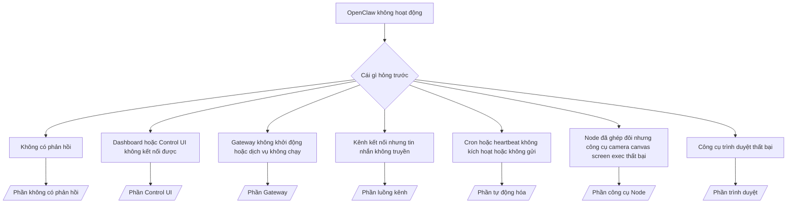

# Xử lý sự cố

Nếu chỉ có 2 phút, dùng trang này như cửa ngõ phân loại.

## 60 giây đầu tiên

Chạy lần lượt các lệnh sau:

```bash
openclaw status
openclaw status --all
openclaw gateway probe
openclaw gateway status
openclaw doctor
openclaw channels status --probe
openclaw logs --follow
```

Kết quả tốt trong một dòng:

- `openclaw status` → hiển thị các kênh đã cấu hình và không có lỗi xác thực rõ ràng.
- `openclaw status --all` → báo cáo đầy đủ có thể chia sẻ.
- `openclaw gateway probe` → mục tiêu gateway mong đợi có thể truy cập (`Reachable: yes`). `RPC: limited - missing scope: operator.read` là chẩn đoán suy giảm, không phải lỗi kết nối.
- `openclaw gateway status` → `Runtime: running` và `RPC probe: ok`.
- `openclaw doctor` → không có lỗi cấu hình/dịch vụ chặn.
- `openclaw channels status --probe` → kênh báo cáo `connected` hoặc `ready`.
- `openclaw logs --follow` → hoạt động ổn định, không có lỗi nghiêm trọng lặp lại.

## Anthropic long context 429

Nếu thấy:
`HTTP 429: rate_limit_error: Extra usage is required for long context requests`,
truy cập [/gateway/troubleshooting#anthropic-429-extra-usage-required-for-long-context](/gateway/troubleshooting#anthropic-429-extra-usage-required-for-long-context).

## Cài đặt plugin thất bại do thiếu openclaw extensions

Nếu cài đặt thất bại với `package.json missing openclaw.extensions`, gói plugin đang dùng cấu trúc cũ mà OpenClaw không chấp nhận nữa.

Sửa trong gói plugin:

1. Thêm `openclaw.extensions` vào `package.json`.
2. Trỏ các mục vào file runtime đã build (thường là `./dist/index.js`).
3. Đăng lại plugin và chạy `openclaw plugins install <npm-spec>` lại.

Ví dụ:

```json
{
  "name": "@openclaw/my-plugin",
  "version": "1.2.3",
  "openclaw": {
    "extensions": ["./dist/index.js"]
  }
}
```

Tham khảo: [Kiến trúc Plugin](/plugins/architecture)

## Cây quyết định



<AccordionGroup>
  <Accordion title="Không có phản hồi">
    ```bash
    openclaw status
    openclaw gateway status
    openclaw channels status --probe
    openclaw pairing list --channel <channel> [--account <id>]
    openclaw logs --follow
    ```

    Kết quả tốt trông như:

    - `Runtime: running`
    - `RPC probe: ok`
    - Kênh hiển thị connected/ready trong `channels status --probe`
    - Sender được phê duyệt (hoặc chính sách DM mở/danh sách cho phép)

    Các mẫu log thường gặp:

    - `drop guild message (mention required` → chặn tin nhắn trong Discord do yêu cầu mention.
    - `pairing request` → sender chưa được phê duyệt và đang chờ phê duyệt ghép đôi DM.
    - `blocked` / `allowlist` trong log kênh → sender, phòng, hoặc nhóm bị lọc.

    Trang chi tiết:

    - [/gateway/troubleshooting#no-replies](/gateway/troubleshooting#no-replies)
    - [/channels/troubleshooting](/channels/troubleshooting)
    - [/channels/pairing](/channels/pairing)

  </Accordion>

  <Accordion title="Dashboard hoặc Control UI không kết nối được">
    ```bash
    openclaw status
    openclaw gateway status
    openclaw logs --follow
    openclaw doctor
    openclaw channels status --probe
    ```

    Kết quả tốt trông như:

    - `Dashboard: http://...` hiển thị trong `openclaw gateway status`
    - `RPC probe: ok`
    - Không có vòng lặp xác thực trong log

    Các mẫu log thường gặp:

    - `device identity required` → HTTP/ngữ cảnh không bảo mật không thể hoàn tất xác thực thiết bị.
    - `AUTH_TOKEN_MISMATCH` với gợi ý thử lại (`canRetryWithDeviceToken=true`) → một lần thử lại với device-token đáng tin có thể tự động xảy ra.
    - lặp lại `unauthorized` sau lần thử lại đó → token/mật khẩu sai, chế độ xác thực không khớp, hoặc token thiết bị ghép đôi cũ.
    - `gateway connect failed:` → UI đang nhắm đến URL/cổng sai hoặc gateway không thể truy cập.

    Trang chi tiết:

    - [/gateway/troubleshooting#dashboard-control-ui-connectivity](/gateway/troubleshooting#dashboard-control-ui-connectivity)
    - [/web/control-ui](/web/control-ui)
    - [/gateway/authentication](/gateway/authentication)

  </Accordion>

  <Accordion title="Gateway không khởi động hoặc dịch vụ đã cài nhưng không chạy">
    ```bash
    openclaw status
    openclaw gateway status
    openclaw logs --follow
    openclaw doctor
    openclaw channels status --probe
    ```

    Kết quả tốt trông như:

    - `Service: ... (loaded)`
    - `Runtime: running`
    - `RPC probe: ok`

    Các mẫu log thường gặp:

    - `Gateway start blocked: set gateway.mode=local` → chế độ gateway chưa đặt/remote.
    - `refusing to bind gateway ... without auth` → bind không phải loopback mà không có token/mật khẩu.
    - `another gateway instance is already listening` hoặc `EADDRINUSE` → cổng đã bị chiếm.

    Trang chi tiết:

    - [/gateway/troubleshooting#gateway-service-not-running](/gateway/troubleshooting#gateway-service-not-running)
    - [/gateway/background-process](/gateway/background-process)
    - [/gateway/configuration](/gateway/configuration)

  </Accordion>

  <Accordion title="Kênh kết nối nhưng tin nhắn không truyền">
    ```bash
    openclaw status
    openclaw gateway status
    openclaw logs --follow
    openclaw doctor
    openclaw channels status --probe
    ```

    Kết quả tốt trông như:

    - Kênh vận chuyển đã kết nối.
    - Kiểm tra ghép đôi/danh sách cho phép qua.
    - Phát hiện mention khi cần.

    Các mẫu log thường gặp:

    - `mention required` → chặn xử lý do yêu cầu mention nhóm.
    - `pairing` / `pending` → sender DM chưa được phê duyệt.
    - `not_in_channel`, `missing_scope`, `Forbidden`, `401/403` → vấn đề token quyền kênh.

    Trang chi tiết:

    - [/gateway/troubleshooting#channel-connected-messages-not-flowing](/gateway/troubleshooting#channel-connected-messages-not-flowing)
    - [/channels/troubleshooting](/channels/troubleshooting)

  </Accordion>

  <Accordion title="Cron hoặc heartbeat không kích hoạt hoặc không gửi">
    ```bash
    openclaw status
    openclaw gateway status
    openclaw cron status
    openclaw cron list
    openclaw cron runs --id <jobId> --limit 20
    openclaw logs --follow
    ```

    Kết quả tốt trông như:

    - `cron.status` hiển thị đã bật với lần thức tiếp theo.
    - `cron runs` hiển thị các mục `ok` gần đây.
    - Heartbeat đã bật và không ngoài giờ hoạt động.

    Các mẫu log thường gặp:

    - `cron: scheduler disabled; jobs will not run automatically` → cron bị tắt.
    - `heartbeat skipped` với `reason=quiet-hours` → ngoài giờ hoạt động đã cấu hình.
    - `requests-in-flight` → làn chính bận; thức heartbeat bị hoãn.
    - `unknown accountId` → tài khoản mục tiêu gửi heartbeat không tồn tại.

    Trang chi tiết:

    - [/gateway/troubleshooting#cron-and-heartbeat-delivery](/gateway/troubleshooting#cron-and-heartbeat-delivery)
    - [/automation/troubleshooting](/automation/troubleshooting)
    - [/gateway/heartbeat](/gateway/heartbeat)

  </Accordion>

  <Accordion title="Node đã ghép đôi nhưng công cụ thất bại camera canvas screen exec">
    ```bash
    openclaw status
    openclaw gateway status
    openclaw nodes status
    openclaw nodes describe --node <idOrNameOrIp>
    openclaw logs --follow
    ```

    Kết quả tốt trông như:

    - Node được liệt kê là đã kết nối và ghép đôi cho vai trò `node`.
    - Có khả năng cho lệnh bạn đang gọi.
    - Trạng thái quyền được cấp cho công cụ.

    Các mẫu log thường gặp:

    - `NODE_BACKGROUND_UNAVAILABLE` → đưa ứng dụng node lên foreground.
    - `*_PERMISSION_REQUIRED` → quyền OS bị từ chối/thiếu.
    - `SYSTEM_RUN_DENIED: approval required` → phê duyệt exec đang chờ.
    - `SYSTEM_RUN_DENIED: allowlist miss` → lệnh không có trong danh sách cho phép exec.

    Trang chi tiết:

    - [/gateway/troubleshooting#node-paired-tool-fails](/gateway/troubleshooting#node-paired-tool-fails)
    - [/nodes/troubleshooting](/nodes/troubleshooting)
    - [/tools/exec-approvals](/tools/exec-approvals)

  </Accordion>

  <Accordion title="Công cụ trình duyệt thất bại">
    ```bash
    openclaw status
    openclaw gateway status
    openclaw browser status
    openclaw logs --follow
    openclaw doctor
    ```

    Kết quả tốt trông như:

    - Trạng thái trình duyệt hiển thị `running: true` và trình duyệt/hồ sơ đã chọn.
    - `openclaw` khởi động, hoặc `user` có thể thấy tab Chrome local.

    Các mẫu log thường gặp:

    - `Failed to start Chrome CDP on port` → khởi động trình duyệt local thất bại.
    - `browser.executablePath not found` → đường dẫn binary cấu hình sai.
    - `No Chrome tabs found for profile="user"` → hồ sơ đính kèm Chrome MCP không có tab Chrome local mở.
    - `Browser attachOnly is enabled ... not reachable` → hồ sơ chỉ đính kèm không có mục tiêu CDP sống.

    Trang chi tiết:

    - [/gateway/troubleshooting#browser-tool-fails](/gateway/troubleshooting#browser-tool-fails)
    - [/tools/browser-linux-troubleshooting](/tools/browser-linux-troubleshooting)
    - [/tools/browser-wsl2-windows-remote-cdp-troubleshooting](/tools/browser-wsl2-windows-remote-cdp-troubleshooting)

  </Accordion>

</AccordionGroup>

\n