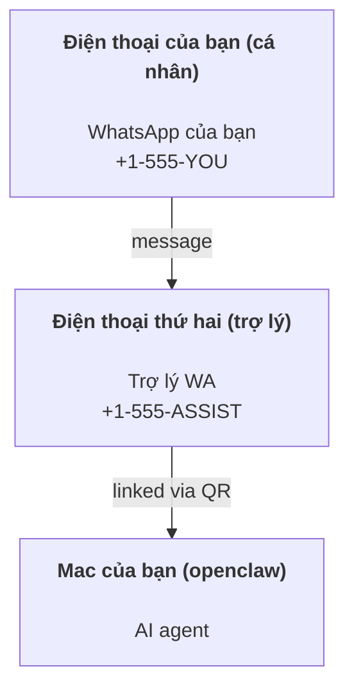

# Xây dựng trợ lý cá nhân với OpenClaw

OpenClaw là một gateway tự host kết nối WhatsApp, Telegram, Discord, iMessage và nhiều hơn nữa với các AI agent. Hướng dẫn này tập trung vào thiết lập "trợ lý cá nhân": một số WhatsApp chuyên dụng hoạt động như trợ lý AI luôn sẵn sàng.

## ⚠️ An toàn là trên hết

Khi sử dụng, agent có thể:

- chạy lệnh trên máy (tùy thuộc vào chính sách công cụ)
- đọc/ghi file trong workspace
- gửi tin nhắn qua WhatsApp/Telegram/Discord/Mattermost (plugin)

Bắt đầu cẩn thận:

- Luôn đặt `channels.whatsapp.allowFrom` (không bao giờ mở cho toàn thế giới trên Mac cá nhân).
- Sử dụng số WhatsApp riêng cho trợ lý.
- Heartbeats mặc định mỗi 30 phút. Tắt cho đến khi tin tưởng thiết lập bằng cách đặt `agents.defaults.heartbeat.every: "0m"`.

## Yêu cầu

- Đã cài đặt và onboard OpenClaw — xem [Bắt đầu](/start/getting-started) nếu chưa thực hiện
- Một số điện thoại thứ hai (SIM/eSIM/trả trước) cho trợ lý

## Thiết lập hai điện thoại (khuyến nghị)

Bạn cần:



Nếu liên kết WhatsApp cá nhân với OpenClaw, mọi tin nhắn gửi đến bạn sẽ trở thành “input cho agent”. Điều này thường không mong muốn.

## Bắt đầu nhanh trong 5 phút

1. Ghép đôi WhatsApp Web (hiển thị QR; quét bằng điện thoại trợ lý):

```bash
openclaw channels login
```

2. Khởi động Gateway (để chạy liên tục):

```bash
openclaw gateway --port 18789
```

3. Đặt cấu hình tối thiểu trong `~/.openclaw/openclaw.json`:

```json5
{
  channels: { whatsapp: { allowFrom: ["+15555550123"] } },
}
```

Gửi tin nhắn đến số trợ lý từ điện thoại đã được cho phép.

Khi hoàn tất onboarding, dashboard tự động mở và in ra link sạch (không token). Nếu yêu cầu xác thực, dán token từ `gateway.auth.token` vào cài đặt Control UI. Để mở lại sau: `openclaw dashboard`.

## Cấp workspace cho agent (AGENTS)

OpenClaw đọc hướng dẫn hoạt động và “bộ nhớ” từ thư mục workspace.

Mặc định, OpenClaw sử dụng `~/.openclaw/workspace` làm workspace cho agent, và sẽ tự tạo (cùng với `AGENTS.md`, `SOUL.md`, `TOOLS.md`, `IDENTITY.md`, `USER.md`, `HEARTBEAT.md`) khi thiết lập/lần đầu chạy agent. `BOOTSTRAP.md` chỉ tạo khi workspace hoàn toàn mới (không quay lại sau khi xóa). `MEMORY.md` là tùy chọn (không tự tạo); khi có, nó được tải cho các session bình thường. Các session subagent chỉ inject `AGENTS.md` và `TOOLS.md`.

Mẹo: coi thư mục này như “bộ nhớ” của OpenClaw và biến nó thành repo git (tốt nhất là private) để backup `AGENTS.md` + file bộ nhớ. Nếu git được cài đặt, workspace mới sẽ tự động khởi tạo.

```bash
openclaw setup
```

Hướng dẫn bố trí workspace + backup đầy đủ: [Agent workspace](/concepts/agent-workspace)
Quy trình bộ nhớ: [Memory](/concepts/memory)

Tùy chọn: chọn workspace khác với `agents.defaults.workspace` (hỗ trợ `~`).

```json5
{
  agent: {
    workspace: "~/.openclaw/workspace",
  },
}
```

Nếu đã có file workspace từ repo riêng, có thể tắt hoàn toàn việc tạo file bootstrap:

```json5
{
  agent: {
    skipBootstrap: true,
  },
}
```

## Cấu hình biến nó thành "trợ lý"

OpenClaw mặc định thiết lập tốt cho trợ lý, nhưng thường cần tinh chỉnh:

- persona/hướng dẫn trong `SOUL.md`
- mặc định suy nghĩ (nếu cần)
- heartbeats (khi đã tin tưởng)

Ví dụ:

```json5
{
  logging: { level: "info" },
  agent: {
    model: "anthropic/claude-opus-4-6",
    workspace: "~/.openclaw/workspace",
    thinkingDefault: "high",
    timeoutSeconds: 1800,
    // Bắt đầu với 0; bật sau.
    heartbeat: { every: "0m" },
  },
  channels: {
    whatsapp: {
      allowFrom: ["+15555550123"],
      groups: {
        "*": { requireMention: true },
      },
    },
  },
  routing: {
    groupChat: {
      mentionPatterns: ["@openclaw", "openclaw"],
    },
  },
  session: {
    scope: "per-sender",
    resetTriggers: ["/new", "/reset"],
    reset: {
      mode: "daily",
      atHour: 4,
      idleMinutes: 10080,
    },
  },
}
```

## Sessions và bộ nhớ

- File session: `~/.openclaw/agents/<agentId>/sessions/{{SessionId}}.jsonl`
- Metadata session (sử dụng token, route cuối, v.v.): `~/.openclaw/agents/<agentId>/sessions/sessions.json` (legacy: `~/.openclaw/sessions/sessions.json`)
- `/new` hoặc `/reset` bắt đầu session mới cho chat đó (có thể cấu hình qua `resetTriggers`). Nếu gửi riêng, agent sẽ trả lời với lời chào ngắn để xác nhận reset.
- `/compact [instructions]` nén ngữ cảnh session và báo cáo ngân sách ngữ cảnh còn lại.

## Heartbeats (chế độ chủ động)

Mặc định, OpenClaw chạy heartbeat mỗi 30 phút với prompt:
`Đọc HEARTBEAT.md nếu có (ngữ cảnh workspace). Thực hiện nghiêm ngặt. Không suy diễn hoặc lặp lại nhiệm vụ cũ từ các chat trước. Nếu không có gì cần chú ý, trả lời HEARTBEAT_OK.`
Đặt `agents.defaults.heartbeat.every: "0m"` để tắt.

- Nếu `HEARTBEAT.md` tồn tại nhưng thực tế trống (chỉ có dòng trống và tiêu đề markdown như `# Heading`), OpenClaw bỏ qua chạy heartbeat để tiết kiệm API call.
- Nếu file thiếu, heartbeat vẫn chạy và model quyết định hành động.
- Nếu agent trả lời với `HEARTBEAT_OK` (có thể có padding ngắn; xem `agents.defaults.heartbeat.ackMaxChars`), OpenClaw ngăn chặn gửi đi cho heartbeat đó.
- Mặc định, gửi heartbeat đến mục tiêu kiểu DM `user:<id>` được phép. Đặt `agents.defaults.heartbeat.directPolicy: "block"` để ngăn chặn gửi trực tiếp trong khi vẫn giữ heartbeat chạy.
- Heartbeats chạy toàn bộ lượt agent — khoảng thời gian ngắn hơn tiêu tốn nhiều token hơn.

```json5
{
  agent: {
    heartbeat: { every: "30m" },
  },
}
```

## Media vào và ra

Tệp đính kèm inbound (hình ảnh/âm thanh/tài liệu) có thể được đưa vào lệnh qua template:

- `{{MediaPath}}` (đường dẫn file tạm local)
- `{{MediaUrl}}` (pseudo-URL)
- `{{Transcript}}` (nếu bật chuyển đổi âm thanh thành văn bản)

Tệp đính kèm outbound từ agent: bao gồm `MEDIA:<path-or-url>` trên dòng riêng (không có khoảng trắng). Ví dụ:

```
Đây là ảnh chụp màn hình.
MEDIA:https://example.com/screenshot.png
```

OpenClaw sẽ trích xuất và gửi chúng như media kèm theo văn bản.

## Danh sách kiểm tra hoạt động

```bash
openclaw status          # trạng thái local (creds, sessions, sự kiện hàng đợi)
openclaw status --all    # chẩn đoán đầy đủ (chỉ đọc, có thể dán)
openclaw status --deep   # thêm kiểm tra sức khỏe gateway (Telegram + Discord)
openclaw health --json   # ảnh chụp sức khỏe gateway (WS)
```

Log nằm dưới `/tmp/openclaw/` (mặc định: `openclaw-YYYY-MM-DD.log`).

## Bước tiếp theo

- WebChat: [WebChat](/web/webchat)
- Vận hành Gateway: [Gateway runbook](/gateway)
- Cron + wakeups: [Cron jobs](/automation/cron-jobs)
- Companion menu bar macOS: [OpenClaw macOS app](/platforms/macos)
- Ứng dụng node iOS: [iOS app](/platforms/ios)
- Ứng dụng node Android: [Android app](/platforms/android)
- Trạng thái Windows: [Windows (WSL2)](/platforms/windows)
- Trạng thái Linux: [Linux app](/platforms/linux)
- Bảo mật: [Security](/gateway/security)\n