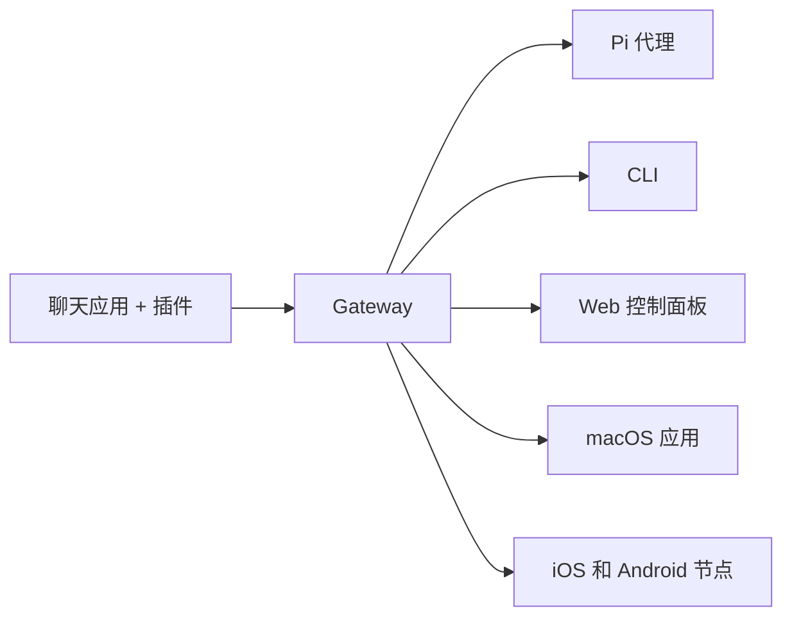

# OpenClaw 🦞

<p align="center">
    
    
</p>

> _"EXFOLIATE! EXFOLIATE!"_ — 可能是一只太空龙虾说的

<p align="center">
  <strong>适用于任何操作系统的 AI 代理网关，支持 WhatsApp、Telegram、Discord、iMessage 等。</strong><br />
  发送一条消息，即可从口袋中获取代理回复。插件可添加 Mattermost 等更多渠道。
</p>

<Columns>
  <Card title="快速开始" href="/start/getting-started" icon="rocket">
    安装 OpenClaw 并在几分钟内启动 Gateway。
  </Card>
  <Card title="运行引导" href="/start/wizard" icon="sparkles">
    使用 `openclaw onboard` 和配对流程进行引导式设置。
  </Card>
  <Card title="打开控制面板" href="/web/control-ui" icon="layout-dashboard">
    启动浏览器仪表盘进行聊天、配置和会话管理。
  </Card>
</Columns>

## 什么是 OpenClaw？

OpenClaw 是一个**自托管网关**，它将你喜爱的聊天应用 — WhatsApp、Telegram、Discord、iMessage 等 — 连接到 AI 编程代理（如 Pi）。你只需在自己的机器（或服务器）上运行一个 Gateway 进程，它就会成为你的消息应用和随时可用的 AI 助手之间的桥梁。

**适合谁？** 希望拥有可以从任何地方发消息的个人 AI 助手的开发者和高级用户 — 无需放弃数据控制权或依赖托管服务。

**有什么不同？**

- **自托管**：运行在你的硬件上，你说了算
- **多渠道**：一个 Gateway 同时服务 WhatsApp、Telegram、Discord 等
- **代理原生**：为编程代理构建，支持工具调用、会话、记忆和多代理路由
- **开源**：MIT 许可证，社区驱动

**你需要什么？** Node 24（推荐），或 Node 22 LTS（`22.16+`）以兼容，来自你选择的提供商的 API 密钥，以及 5 分钟时间。为获得最佳质量和安全性，请使用可用的最强最新一代模型。

## 工作原理



Gateway 是会话、路由和渠道连接的唯一事实来源。

## 核心能力

<Columns>
  <Card title="多渠道网关" icon="network">
    WhatsApp、Telegram、Discord 和 iMessage 共用一个 Gateway 进程。
  </Card>
  <Card title="插件渠道" icon="plug">
    通过扩展包添加 Mattermost 等更多渠道。
  </Card>
  <Card title="多代理路由" icon="route">
    按代理、工作空间或发送者隔离会话。
  </Card>
  <Card title="媒体支持" icon="image">
    发送和接收图片、音频和文档。
  </Card>
  <Card title="Web 控制面板" icon="monitor">
    浏览器仪表盘用于聊天、配置、会话和节点管理。
  </Card>
  <Card title="移动节点" icon="smartphone">
    配对 iOS 和 Android 节点，实现 Canvas、摄像头和语音工作流。
  </Card>
</Columns>

## 快速开始

<Steps>
  <Step title="安装 OpenClaw">
    ```bash
    npm install -g openclaw@latest
    ```
  </Step>
  <Step title="引导并安装服务">
    ```bash
    openclaw onboard --install-daemon
    ```
  </Step>
  <Step title="聊天">
    在浏览器中打开控制面板并发送消息：

    ```bash
    openclaw dashboard
    ```

    或者连接一个渠道（[Telegram](/channels/telegram) 最快）并从手机聊天。

  </Step>
</Steps>

需要完整的安装和开发设置？请参阅[快速开始](/start/getting-started)。

## 仪表盘

在 Gateway 启动后打开浏览器控制面板。

- 本地默认：[http://127.0.0.1:18789/](http://127.0.0.1:18789/)
- 远程访问：[Web 界面](/web) 和 [Tailscale](/gateway/tailscale)

<p align="center">
  
</p>

## 配置（可选）

配置文件位于 `~/.openclaw/openclaw.json`。

- 如果你**什么都不做**，OpenClaw 将使用内置的 Pi 二进制文件以 RPC 模式运行，并按发送者分隔会话。
- 如果你想要锁定权限，可以从 `channels.whatsapp.allowFrom` 和（对于群组）提及规则开始。

示例：

```json5
{
  channels: {
    whatsapp: {
      allowFrom: ["+15555550123"],
      groups: { "*": { requireMention: true } },
    },
  },
  messages: { groupChat: { mentionPatterns: ["@openclaw"] } },
}
```

## 从这里开始

<Columns>
  <Card title="文档中心" href="/start/hubs" icon="book-open">
    按用例组织的所有文档和指南。
  </Card>
  <Card title="配置" href="/gateway/configuration" icon="settings">
    核心 Gateway 设置、令牌和提供商配置。
  </Card>
  <Card title="远程访问" href="/gateway/remote" icon="globe">
    SSH 和 tailnet 访问模式。
  </Card>
  <Card title="渠道" href="/channels/telegram" icon="message-square">
    WhatsApp、Telegram、Discord 等的渠道特定设置。
  </Card>
  <Card title="节点" href="/nodes" icon="smartphone">
    iOS 和 Android 节点，支持配对、Canvas、摄像头和设备操作。
  </Card>
  <Card title="帮助" href="/help" icon="life-buoy">
    常见修复和故障排除入口。
  </Card>
</Columns>

## 了解更多

<Columns>
  <Card title="完整功能列表" href="/concepts/features" icon="list">
    完整的渠道、路由和媒体能力。
  </Card>
  <Card title="多代理路由" href="/concepts/multi-agent" icon="route">
    工作空间隔离和按代理分隔的会话。
  </Card>
  <Card title="安全" href="/gateway/security" icon="shield">
    令牌、允许列表和安全控制。
  </Card>
  <Card title="故障排除" href="/gateway/troubleshooting" icon="wrench">
    Gateway 诊断和常见错误。
  </Card>
  <Card title="关于和致谢" href="/reference/credits" icon="info">
    项目起源、贡献者和许可证。
  </Card>
</Columns>
